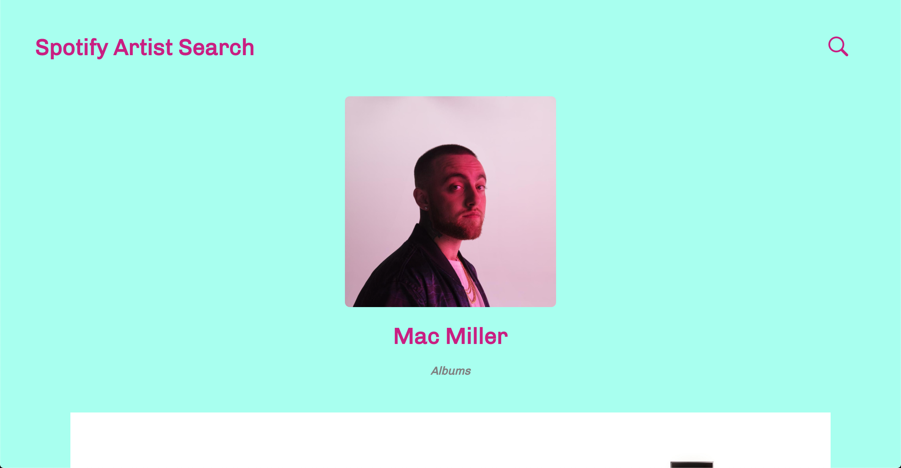

# Spotify Artist Search - Touchtunes Assignment

## How to run it

- Move to repo: `cd <repo-name>`
- Install dependencies: `npm install`
- Run on localhost port 3000 `npm start`

I hope you'll like it! 😀

## Screenshots

### Login Page

### Spotify Login Page

### Search Page

### Search Results

### Single Artist Page

### Artist Albums

