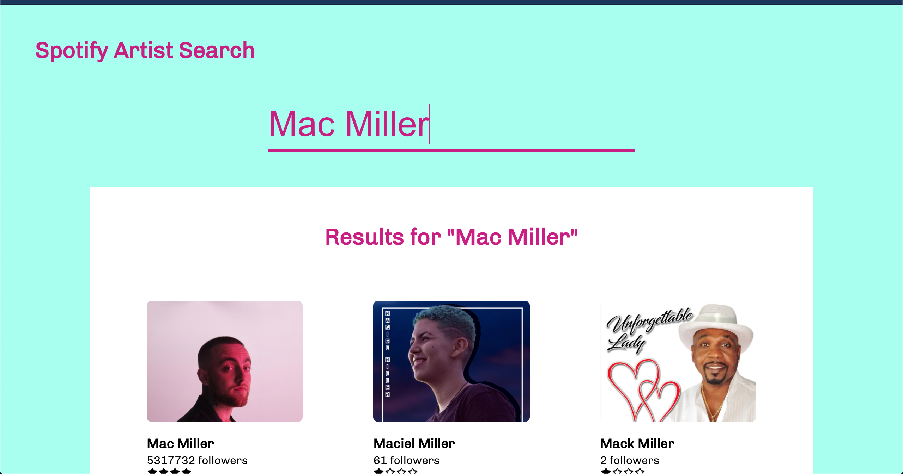

# Spotify Artist Search - Touchtunes Assignment

## How to run it

- Clone the repo `git clone https://github.com/gautiermarechal/touchtunes-spotify.git`
- Move to repo: `cd touchtunes-spotify`
- Install dependencies: `npm install`
- Run on localhost port 3000 `npm start`

I hope you'll like it! 😀

## Comments

- .env file should not be commited to github. I did not put the file in gitignore for you to test the project locally
- In production, we should not put .env in front-end as it will be present in the build files. Again, I put the file in front-end for demo purpose.
- This is an MVP. For production, next steps would be to make sure all API credentials are well hidden. I would also add animations to improve the UI and UX.

## Screenshots

### Login Page

### Spotify Login Page

### Search Page

### Search Results

### Single Artist Page

### Artist Albums

